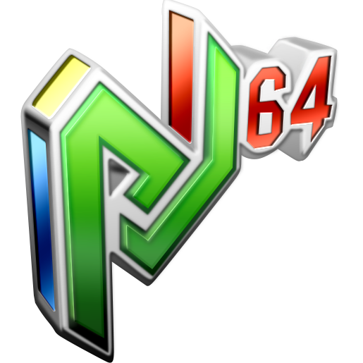

  

# Project64

Project64 is a free and open-source emulator for the Nintendo 64 and Nintendo 64 Disk Drive written in C++ currently only for Windows (planned support for other platforms in the future).

  * [Features](#features)
  * [Screenshot](#screenshot)
  * [Installation](#installation)
  * [Supported requirements](#supported-requirements)
  * [Support](#support)
  * [Changelog](#changelog)
  * [Dependencies](#dependencies)
  * [Contributing](#contributing)
  * [Maintainers and contributors](#maintainers-and-contributors)
  * [🔗 Links](#---links)
  * [License](#license)

## Features

- Development and debugging tools
- Save/load states
- Fullscreen
- Controller support
- Great language support
- Support for many popular N64 emulator plugins

## Screenshot

  

## Installation

Installer for the latest stable releases are available [here](https://www.pj64-emu.com/windows-downloads).

Download nightly builds [here](https://www.pj64-emu.com/nightly-builds).

AppVeyor (Windows x86/x64): 

*Side note: 64-bit builds are considered experimental and aren't currently supported*

## Supported requirements

* Operating system
  * 64-bit Windows 10 and 11
* CPU
  * 1GHz or faster Intel or AMD processor with at least SSE2 support
* RAM
  * 2GB or more
* Graphics card
  * DirectX 8 capable (Jabo's Direct3D8)
  * OpenGL 3.3 capable (Project64 Video)
  * OpenGL 3.3 capable (GLideN64)
  * OpenGL 3.3 capable (Angrylion's RDP Plus)
  * Vulkan 1.1 capable (Parallel-RDP)

Intel integrated graphics can have issues that are not present with Nvidia and AMD GPU's even when the requirements are met. Outdated drivers can also cause issues, so please update them!

## Support

For support, we ask all users read our [support document](./Docs/SUPPORT.md). Read this ***before*** opening issues.

Please join our [Discord server](https://discord.gg/Cg3zquF) for support, questions, etc.

## Changelog

If you would like to see a changelog that is available [here](./Docs/CHANGELOG.md).

## Dependencies

- [Duktape](https://duktape.org/): MIT license
- [7-Zip](https://7-zip.org/): LGPL+unRAR license
- [zlib](https://zlib.net/): zlib license
- [libpng](http://libpng.org/pub/png/libpng.html): libpng license
- [discord-rpc](https://github.com/discord/discord-rpc): MIT license
- DirectX: Copyright (C) Microsoft
- [Windows Template Library](https://wtl.sourceforge.io/): Common Public License

## Contributing

Contributions are always welcome!

See the [contributing](./.github/CONTRIBUTING.md) file for ways to get started.

## Maintainers and contributors

- [@Project64](https://www.github.com/project64) - Zilmar - current maintainer
- Jabo - Previous contributor
- Smiff - Previous contributor
- Gent - Previous contributor

Also see the list of [community contributors](https://github.com/project64/project64/contributors).

## 🔗 Links
- [Website](https://pj64-emu.com)
- [Discord](https://discord.gg/Cg3zquF)

## License

Please see the [license](./license.md) for more details.
