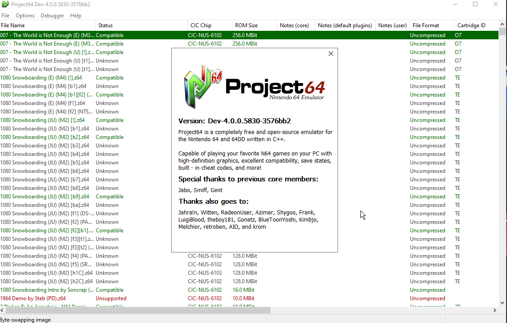

  

# Project64

Project64 is a free and open-source emulator for the Nintendo 64 and Nintendo 64 Disk Drive written in C++ currently only for Windows (planned support for other platforms in the future).

## Features

- Development and debugging tools
- Save/load states
- Fullscreen
- Controller support
- Great language support
- Support for many popular N64 emulator plugins

## Screenshots

## Installation

Installer for the latest stable releases are available [here](https://www.pj64-emu.com/windows-downloads).

Download nightly builds [here](https://www.pj64-emu.com/nightly-builds).

AppVeyor (Windows x86/x64): 
## Minimum requirements

* Operating system (limited support for Windows 8.1 and below)
  * Windows XP SP3, Windows 7 SP1, Windows 8.1, and the latest version of Windows 10
* CPU
  * Intel or AMD processor with at least SSE2 support
* RAM
  * 512MB or more
* Graphics card
  * DirectX 8 capable (Jabo's Direct3D8)
  * OpenGL 1.1 capable (Project64 Video)
  * OpenGL 3.3 capable (GLideN64)
## Support

For support, we ask all users read our [support document](https://github.com/project64/project64/blob/develop/Docs/SUPPORT.md). Read this ***before*** opening issues.

Please join our [Discord server](https://discord.gg/Cg3zquF) for support, questions, etc.

## Changelog

If you would like to see a changelog that is available [here](https://github.com/project64/project64/blob/develop/Docs/CHANGELOG.md).
## Dependencies

- Duktape: MIT license
- 7-Zip: LGPL+unRAR license
- zlib: zlib license
- png: libpng license
- discord-rpc: Copyright (C) Discord
- DirectX: Copyright (C) Microsoft
- Windows Template Library: Copyright (C) Microsoft
## Contributing

Contributions are always welcome!

See the [contributing](https://github.com/project64/project64/blob/develop/.github/CONTRIBUTING.md) file for ways to get started.

## Roadmap

#### Just a note that these aren't guaranteed to happen, just things we'd like to implement at some point

- Improve the accuracy of the CPU interpreter/CPU recompiler
- Improve the accuracy of the RSP interpreter/RSP recompiler
- Feature parity between the CPU interpreter/recompiler and feature parity between the RSP interpreter/recompiler
- Working Android port
- Working Linux port
- Dark mode
- Update dependencies
- Code cleanup and refactoring
- UI/UX improvements
## Authors and contributors

- [@Project64](https://www.github.com/project64) - Zilmar - current maintainer
- Jabo - Previous contributor
- Smiff - Previous contributor
- Gent - Previous contributor

Also see the list of [community contributors](https://github.com/project64/project64/contributors).
## 🔗 Links
- [Website](https://pj64-emu.com)
- [Discord](https://discord.gg/Cg3zquF)
## License

Please see the [license](https://github.com/project64/project64/blob/develop/license.md) for more details.
## Acknowledgements
 
 - [Past and current contributors of MAME](https://github.com/mamedev/mame)
 - [Past and current contributors of Ares](https://github.com/ares-emulator/ares)
 - [Past and current contributors of Mupen64Plus](https://github.com/mupen64plus)
 - [Past and current contributors of RetroArch](https://github.com/libretro/RetroArch)
 - [Past and current contributors of CEN64](https://github.com/n64dev/cen64)
 - All of the people who have contributed to Project64 over the years!
 - The efforts of the community to endlessly research and improve!
 - You for reading this, thanks! 😉